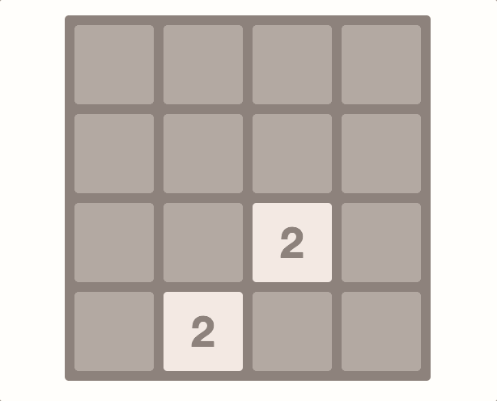

# React.js 2048 game [🎮](https://offreal.github.io/react-2048/)

Implementation of the popular mobile game 2048 in React.js

## Left to do
* Game over implementation;
* Points system;
* Scoring when merge cells;
* Writing tests for all existing logic.

## Available scripts

#### `yarn start` 

Use to deploy local development server

#### `yarn dev`

Use to create an assembly in development mode

#### `yarn build`

Use to create an assembly in production mode

#### `yarn test`

Use to run all tests (in development)

#### `yarn deploy`

Use to publish the final build to github pages. Before submitting, you need to specify a link to the repository in *package.json* in *home*

## Technologies

* [React](https://reactjs.org) - A JavaScript library for building user interfaces
* [Webpack](https://webpack.js.org/) - App builder
* [Babel](https://babeljs.io/) - JS compiler
* [Yarn](https://yarnpkg.com/) - Package dependency Management
* [ESLint](https://eslint.org/) - App linter
* [Prettier](https://prettier.io/) - Code formatter
* [Styled components](https://styled-components.com/) - Visual primitives for the component age
* [Rotate matrix](https://github.com/miguelmota/rotate-matrix) - Simple library for rotate matrix
* [uniqid](https://github.com/adamhalasz/uniqid/) - A Unique Hexatridecimal ID generator

## Authors

* **Sergey Shvets** - [offreal](https://github.com/offreal)

## License

This project is licensed under the MIT License - see the [LICENSE](LICENSE) file for details
